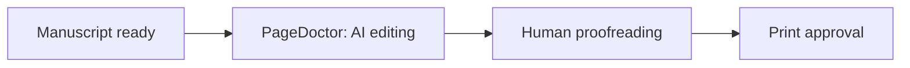
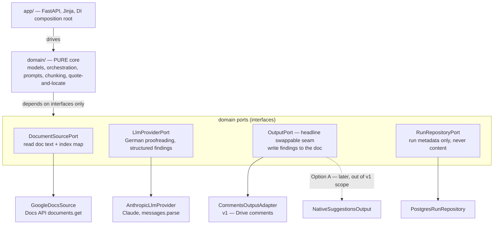

# CLAUDE.md

This file provides guidance to Claude Code (claude.ai/code) when working with code in this repository.

> **Authoritative inputs.** The three handoff docs in `docs/` (`PAGEDOCTOR.md`, `PAGEDOCTOR_CONTEXT.md`, `PAGEDOCTOR_FEASIBILITY.md`) are the source of truth for *what* PageDoctor is. This file is the source of truth for *how* it is built. Where the handoff docs disagree among themselves, the team feedback in `PAGEDOCTOR_CONTEXT.md` and the locked decision in `PAGEDOCTOR_FEASIBILITY.md` win.

---

## 1. What this is

PageDoctor is the **AI editing stage** in BookHub's (a German Print-on-Demand publisher) book-production pipeline:



An internal **project manager** points the tool at a creator's Google Doc, picks a check mode and settings, and clicks "Review." An LLM proofreads and/or copy-edits the **whole manuscript in German** and writes its findings back into that doc as **comments**, under the identity of a fictional editor, **Sophie Hoffmann**. The creator reviews in Google Docs. PageDoctor does the first pass; a human editor does the final polish.

Two parts: a **minimal internal PM web app** (one form, one button, one progress bar — not creator-facing) and **output written into the creator's Google Doc** as Sophie's comments.

### Locked decisions — encode these, do not relitigate

- **Output = comments-only (Drive API) for v1.** A server-side service account **cannot** create native Google Docs suggestions (`SuggestInsertText`/`SuggestDeleteText` do not exist; API comments cannot be anchored to a span — verified, see `docs/PAGEDOCTOR_FEASIBILITY.md`). Sophie posts structured comments and **never mutates the manuscript**. Each posted comment carries only the **exact quoted original text**, the **proposed change**, and a **one-line German reason** — no header, no label, no id, no signature in the visible text (Sophie reads like an editor, not a script). **Category and priority stay internal**: the LLM still assigns them per finding (used for strictness gating and future filtering) but they are never rendered into the comment text, since there is no channel to carry them that isn't visible to the creator. Idempotency re-derives a finding's key from its own quoted content (original text + proposed change only, not category — see `domain/services/comment_format.py` and `domain/services/idempotency.py`). Plus one **consistency-report** comment — **paused for this version** (issue #29): the whole-book consistency pass still runs on every review, it just isn't posted to the doc yet, pending a UX decision on how it should reach the creator.
- **The output adapter is the headline architectural seam.** v1 has one implementation (`CommentsOutputAdapter`). A future "Option A" (browser automation producing native suggestions) must slot in behind the same port **without touching** the AI engine, persona, modes, or config. Design for this from line one.
- **Two check modes**, individually or combined: **Proofreading** (Korrektorat — spelling/grammar/punctuation) and **Editing** (Lektorat — style/consistency/repetition/readability).
- **Configurable:** book type (cookbook / advice / novel-memoir / children's), strictness (light / standard / thorough), language (German primary), custom dictionary, recipe mode.
- **AI engine:** chunk-wise over long manuscripts, with a **whole-book consistency pass** (names, terms, spelling variants, repetition stats). Findings map to exact text via **quote-and-locate** — never trust model-reported character offsets.
- **Sophie persona:** all doc output in German, warm competent-editor tone, never "AI" language.
- **Data protection (hard):** manuscripts are confidential and unpublished — analysis only, never stored, never used for training; Google access scoped to the single doc, never the whole Drive; never log manuscript text. See §9.

---

## 2. Architecture — hexagonal (ports & adapters)

The **domain core is pure**: editing logic, orchestration, and typed models that depend on **nothing external** (no `google`, no `anthropic`, no `fastapi`, no `sqlalchemy` imports). Everything that touches the network, the LLM, Google, the DB, or the clock is an **adapter** behind a **port** (a `Protocol`/ABC defined in the domain). Adapters are **injected** at the boundary; the domain never constructs a client.



### The four ports (defined in `domain/ports/`)

| Port | Responsibility | v1 adapter |
|---|---|---|
| `DocumentSourcePort` | Read the document's plain text **and** an index map (so spans can be translated to Docs API ranges later). Re-read fresh on every run — never reuse stale indices (a second pass may run after creator edits). | `GoogleDocsSource` (Docs API `documents.get`) |
| `LlmProviderPort` | Given a chunk + config, return **typed findings** (validated models, not dicts). | `AnthropicLlmProvider` |
| `OutputPort` (headline seam) | Write findings + consistency report to the doc. **The swappable seam.** | `CommentsOutputAdapter` (Drive `comments.create`) |
| `RunRepositoryPort` | Persist/read **run metadata only** (doc id, timestamp, mode, settings, status, counts). Never manuscript or finding content. | `PostgresRunRepository` |

The **AI engine, Sophie persona, the two modes, configuration, and workflow are identical regardless of which `OutputPort` adapter is wired in.** Build them once. When Option A lands, it is a new `OutputPort` implementation and a DI change — nothing in `domain/` moves.

---

## 3. Tech stack & rationale

| Concern | Choice | Why |
|---|---|---|
| Language | **Python 3.12+** | The real work is AI + Google orchestration; one language, strong typing via Pydantic. |
| Web | **FastAPI** + **Jinja2** + **HTMX** | "One form, one button, one progress bar" — server-rendered, no Node toolchain, one deployable. HTMX drives the progress feed (SSE/polling). |
| Domain models | **Pydantic v2** | Typed entities across every boundary; validation at the edges; `messages.parse()` returns these directly. |
| LLM | **Anthropic Claude API** via the `anthropic` Python SDK | Best-in-class German + strict structured-output discipline. See §7 for the model choice and the **ZDR constraint**. |
| Google | `google-api-python-client` + `google-auth` | Docs API (read) + Drive API (comments), service-account auth, single-doc scope. |
| Persistence | **PostgreSQL** via SQLAlchemy 2.0 (+ Alembic) | Metadata-only (§9). Behind `RunRepositoryPort` so the engine never imports the ORM. |
| Config | **pydantic-settings** (12-factor, env vars) | Validate **all** config at startup; fail fast; `.env.example` documents every key. |
| Packaging / tasks | **uv** (or `pip` + `venv`) + a `Makefile` | Reproducible installs; one-word dev commands. |
| Quality gates | **ruff** (lint+format) · **mypy --strict** · **pytest** · **pre-commit** | See §11–§12. |
| Container | One **Dockerfile**; deploy target deferred | 12-factor config means the host is a late binding (ECS/Fargate, Fly, Render — decide at deploy). |

---

## 4. Directory structure

The domain/adapter split must be **visible in the tree**. `domain/` has no third-party I/O imports.

```
src/pagedoctor/
  domain/                      # PURE CORE — no network, no I/O, no framework imports
    models/                    # Pydantic entities (§6)
      finding.py               # Finding, Suggestion, Priority, Category
      config.py                # ReviewConfig, CheckMode, BookType, Strictness, CustomDictionary
      document.py              # SourceDocument, TextChunk, LocatedSpan, IndexMap
      consistency.py           # ConsistencyReport, TermVariant, RepetitionStat
      run.py                   # ReviewRun, RunStatus  (metadata only)
    ports/                     # Protocol/ABC interfaces — the seams
      document_source.py       # DocumentSourcePort
      llm_provider.py          # LlmProviderPort
      output.py                # OutputPort  — headline swappable seam
      run_repository.py        # RunRepositoryPort
    services/                  # Orchestration & pure compute
      review_orchestrator.py   # the top-level use case: read → chunk → analyze → consolidate → write
      chunker.py               # pure: manuscript → TextChunk[]
      locator.py               # pure: quote-and-locate (model quote → LocatedSpan); NEVER trust offsets
      consistency.py           # pure: accumulate glossary/term map, flag deviations, repetition stats
    prompts/                   # prompt construction per (mode × book_type × strictness)
      builder.py               # pure: ReviewConfig → system+user prompt (Sophie persona, German)
      templates/               # German prompt fragments, per book type & strictness
    errors.py                  # typed domain exceptions (§5)

  adapters/                    # everything external — imports live HERE, never in domain/
    google/
      docs_source.py           # GoogleDocsSource    : DocumentSourcePort
      comments_output.py       # CommentsOutputAdapter : OutputPort  (v1)
      auth.py                  # service-account credentials, single-doc scope
    llm/
      anthropic_provider.py    # AnthropicLlmProvider : LlmProviderPort
    persistence/
      models.py                # SQLAlchemy tables (metadata only)
      run_repository.py        # PostgresRunRepository : RunRepositoryPort
      migrations/              # Alembic

  app/                         # delivery layer (FastAPI + HTMX)
    main.py                    # app factory, lifespan, startup config validation (fail fast)
    container.py               # composition root — builds & injects adapters (no global clients)
    routes.py                  # POST /review, GET /runs, progress feed
    templates/                 # review_form.html, progress.html
    static/

  config.py                    # pydantic-settings Settings — validated at startup
  logging.py                   # structured logging + correlation id; redaction guard (§9)

tests/
  unit/                        # domain core — ZERO network, no adapters
  adapters/                    # adapter tests with Google + Anthropic MOCKED
  integration/                 # end-to-end with all externals mocked/faked
  fixtures/                    # synthetic German manuscripts — NEVER real creator content

docs/                          # the three handoff docs (read-only source of truth)
.env.example
Dockerfile
Makefile
pyproject.toml
```

---

## 5. Coding standards (concrete for this stack)

These are not suggestions — they are the contract every change is held to, enforced by the tooling in §5.13. Write code that a future maintainer (or the next Claude) can extend without re-reading the whole module.

### 5.1 Types & data
- **`mypy --strict` passes.** Every function is fully annotated. **No `Any`** without an inline `# Any: <reason>` justification.
- **Modern Python.** Built-in generics (`list[str]`, `dict[str, int]`), `X | None` over `Optional`, `StrEnum` for every fixed value set.
- **Pydantic v2 for all domain data.** Value objects are `frozen=True`. **Never pass a `dict` across a boundary** — a function that takes or returns structured data takes or returns a typed model. **Never** return a `{"success": ..., "error": ...}` shape; success is a value, failure is a raised exception (§5.2).
- **Don't probe objects whose shape you know.** No `getattr` / `.get()` / `isinstance` on a `Finding`, a `ReviewConfig`, or any typed model — access the attribute directly. If you feel the need to probe, the type annotation is wrong; fix the type, not the access.

### 5.2 Errors — raise, never return
- A typed exception hierarchy rooted at `PageDoctorError` in `domain/errors.py` (e.g. `ManuscriptTooLargeError`, `SpanNotLocatableError`, `DocumentAccessDeniedError`, `LlmResponseInvalidError`, `TokenBudgetExceededError`, `ConfigError`). Domain and adapter code **raises**; it never returns error flags, error dicts, or `None`-as-failure.
- **The only catch site is the boundary** — FastAPI routes (`app/routes.py`). There, domain exceptions map to HTTP responses. A `try/except` buried in the domain or an adapter that swallows an error and returns a sentinel is a defect.

### 5.3 Functions — one job each
- **Compute a value OR perform a side effect — never both.** A function that calculates also returning a write is two functions.
- **Reads never mutate.** Anything named `calculate_*` / `build_*` / `locate_*`, and every `GET` route, is side-effect-free. Mutation lives in explicitly-named writers and `POST` routes.
- Pure compute (chunking, quote-and-locate, consistency accumulation, prompt building) stays pure and lives in `domain/services/`; I/O lives in adapters and the orchestrator's thin edges.

### 5.4 Naming & readability
- **Self-documenting names a non-technical stakeholder could read** — `locate_quote_in_document`, not `proc`. **No leading underscores on regular functions.**
- **No docstrings.** **Comments only for genuinely non-obvious *why*** — never to restate *what* the code already says. No dead or commented-out code.

### 5.5 Imports
- All imports at the **top** of the file, in **three groups** separated by a blank line: stdlib, third-party, local. **Absolute imports only** — no relative `from ..x import y`.

### 5.6 DRY
- If an enum, constant, model, builder, exception, or utility already exists, **import and use it** — never recreate it. Run the **`pagedoctor-lookup`** subagent before adding anything new (§5.13).

### 5.7 Hexagonal purity & dependency injection
- **`domain/` imports only stdlib + Pydantic.** No `fastapi`, `anthropic`, `google`/`googleapiclient`, `sqlalchemy`, `alembic`, or HTTP clients anywhere under `domain/`. Enforced by `tests/unit/test_domain_purity.py` and the `domain_purity` hook.
- **Dependency injection via the composition root** (`app/container.py`). **No module-level client or singleton globals.** PageDoctor is a long-running service, not a Lambda — a global `Anthropic()` or Google client is a banned shortcut. Construct clients once at startup, inject them down.
- **Adapters map raw SDK/JSON ↔ domain models at the edge.** The domain **never** sees a raw Anthropic response, a Google API object, or a SQLAlchemy row — only typed domain models cross the port.

### 5.8 Async correctness
- **Never call blocking I/O inside an `async` path.** No synchronous Google client call, blocking DB call, or `requests` inside an `async def`. Use an async client or offload to a worker thread. Don't mix sync and async carelessly — pick one per call path and keep it consistent.

### 5.9 Persistence (SQLAlchemy / Alembic)
- **SQLAlchemy lives behind the repository.** ORM models never leak past the adapter; `RunRepositoryPort` implementations accept and return **domain models**, not rows.
- **All schema changes go through Alembic** via the `new-migration` skill — **never hand-author or hand-edit a revision file.** The schema is **metadata only**; there is no column for manuscript or finding text (§9).

### 5.10 LLM (Anthropic SDK)
- **Typed structured output** via `messages.parse` into the `ChunkFindings` wrapper model. On validation failure, **raise `LlmResponseInvalidError`** — do not paper over it. **Never raw-string-match** tool or JSON output; parse it into a model.
- Default `claude-opus-4-8` under **zero-data-retention + no-training** (§7) — Fable 5 is disqualified.

### 5.11 Web (FastAPI + HTMX / Jinja)
- **Dumb templates.** Jinja templates do presentation only — no business logic, no data fetching. Logic lives in the app layer; the template receives ready-to-render typed view data.
- **Escape output** (Jinja autoescape on) and put a **CSRF token on the review form.**
- Routes are the **only** place domain exceptions are caught and mapped to HTTP (§5.2).

### 5.12 Config, logging & the two hard rules
- **Fail fast.** `pydantic-settings` validates **all** config at startup with guard clauses. **Never silent-default a required secret or setting** — a missing `ANTHROPIC_API_KEY` or DB URL crashes on boot, not at first request.
- **Structured logging only**, with **one correlation id per review run.** **Never log secrets, PII, or manuscript/finding text.** A log line containing manuscript content is a **defect** — guarded by the `data-protection` hook and the `data-protection-auditor` subagent (§9).
- **Idempotency is a coding rule, not just a feature.** Comment-posting must be safe to retry without double-posting (per-finding key checkpoint, §10). Writing to an author's doc is the one place a bug corrupts real, irreplaceable work — every write path is coded replay-safe by default.

### 5.13 Tests & commits
- **Tests are first-class and kept** (never disposable). Domain unit tests run against **fake ports** with zero network; adapter tests run with the Anthropic SDK, Google APIs, and the DB **mocked**. A new port ships with a fake in-memory implementation; a new adapter ships with a mocked-dependency test.
- **Conventional commits**, small focused changes.

### 5.14 Tooling that enforces these standards
The path of least resistance is the correct one — use the project tooling instead of hand-rolling:
- **Skills** (`.claude/skills/`): `new-domain-model`, `new-port`, `new-adapter`, `new-migration`, `german-eval`.
- **Subagents** (`.claude/agents/`): `pagedoctor-lookup` (DRY pre-check before writing), `hexagonal-guard` (architecture review of a diff), `data-protection-auditor` (content-leak / scope-widening review of a diff).
- **Hooks** (`.claude/settings.json`): per-edit `ruff --fix` + `ruff format` + `mypy`; the domain-purity check on any `domain/` edit; a data-protection tripwire on every Python edit; and a `ruff`+`mypy`+`pytest` quality gate on turn end. All degrade gracefully until the toolchain is installed (Foundation, #2).

---

## 6. Domain model sketch (typed entities)

All in `domain/models/`, all Pydantic v2, all `frozen=True` where they are values. Illustrative — names are the contract, fields will grow:

```python
class CheckMode(StrEnum):      PROOFREADING; EDITING            # selectable individually or combined
class Category(StrEnum):       PROOFREADING; EDITING            # which mode produced a finding
class Priority(StrEnum):       FEHLER; EMPFEHLUNG; HINWEIS       # shown as "Fehler"/"Empfehlung"/"Hinweis"
class BookType(StrEnum):       COOKBOOK; ADVICE; NOVEL_MEMOIR; CHILDRENS
class Strictness(StrEnum):     LIGHT; STANDARD; THOROUGH
class RunStatus(StrEnum):      PENDING; RUNNING; WRITING; DONE; INCOMPLETE; FAILED
                              # INCOMPLETE/FAILED ≠ DONE — a half-written doc is never "done" (§10)

class ReviewConfig(BaseModel):                 # the PM form, validated
    modes: frozenset[CheckMode]
    book_type: BookType
    strictness: Strictness
    language: str = "de-DE"
    custom_dictionary: CustomDictionary        # words Sophie must ignore
    recipe_mode: bool = False                   # cookbook-only extra checks

class LocatedSpan(BaseModel):                  # output of quote-and-locate
    quote: str                                  # exact text found in the doc
    start: int; end: int                        # resolved index range (for a future native adapter)

class Suggestion(BaseModel):
    original_text: str                          # exact quoted original
    proposed_change: str
    reason_de: str                              # one-line German reason

class Finding(BaseModel):
    suggestion: Suggestion
    category: Category
    priority: Priority
    located: LocatedSpan | None                 # None ⇒ could not be located; surfaced, not silently dropped
    # NOTE: keep Finding/Suggestion flat and simple — structured outputs do NOT enforce
    # numeric/string field constraints (minimum/maximum, minLength/maxLength) or recursive
    # schemas; the SDK strips them and validates client-side. Do not lean on field
    # constraints here for correctness.

class ChunkFindings(BaseModel):                # the LLM parse target — messages.parse() returns
    findings: list[Finding]                     # a single .parsed_output object, NOT a bare list.
                                                # Wrap the N findings per chunk in this model.

class ConsistencyReport(BaseModel):
    term_variants: list[TermVariant]            # "Basilikum" vs "Baslikum" across the whole book
    spelling_variants: list[TermVariant]
    repetition_stats: list[RepetitionStat]      # per chapter

class ReviewRun(BaseModel):                    # METADATA ONLY — never holds manuscript/finding text
    id: UUID; doc_id: str; config: ReviewConfig
    status: RunStatus; started_at; finished_at
    finding_count: int; correlation_id: str
    posted_finding_keys: frozenset[str]         # idempotency checkpoint (§10): stable per-finding
                                                # hashes already written to the doc — never re-post
    token_budget: int | None                    # optional per-run cost ceiling (§7); stop if exceeded
```

---

## 7. AI engine

**Provider/model.** Anthropic Claude via the `anthropic` Python SDK. **Default model: `claude-opus-4-8`** for editorial-grade German.

> **ZDR constraint — do not use Claude Fable 5.** PageDoctor's hard data-protection rule (§9) requires zero data retention. **Claude Fable 5 is *not available* under ZDR** (it mandates 30-day retention) — so it is disqualified despite being the most capable model. Use `claude-opus-4-8` (ZDR-compatible) as the default; `claude-sonnet-4-6` is the acceptable cost-down option. Confirm zero-data-retention + no-training is contractually enabled on the Anthropic org before processing real manuscripts.

**SDK usage that the domain needs:**
- **Structured findings, not prose.** Use `client.messages.parse(..., output_format=ChunkFindings)`. `parse()` returns a **single `.parsed_output` object, not a bare list** — so the parse target is the **`ChunkFindings` wrapper** (`{ findings: list[Finding] }`, §6), and you read `result.parsed_output.findings`. No dict parsing, no `Any`. Validation failure → raise `LlmResponseInvalidError`. Note structured outputs **do not enforce field constraints** (`minimum`/`maxLength`/etc.) or recursive schemas — the SDK strips them and validates client-side, so keep `Finding`/`Suggestion` flat and don't rely on schema constraints for correctness.
- **Adaptive thinking:** `thinking={"type": "adaptive"}` with `output_config={"effort": "high"}` for the analysis passes (editorial judgment is intelligence-sensitive). `thinking={"type":"enabled", "budget_tokens": ...}` is **removed** on Opus 4.8 — do not use it. No `temperature`/`top_p`.
- **Streaming** for the consistency pass and any large output (`max_tokens` > ~16k must stream).
- **Prompt caching:** the stable prefix is **Sophie's persona + the per-(book_type × strictness) instructions + the custom dictionary**. Put that first with `cache_control`; put the **volatile chunk text last** (after the breakpoint). Manuscript chunks change every call, so they must never sit inside the cached prefix. **The cache minimum on `claude-opus-4-8` is 4096 tokens** — a prefix shorter than that silently won't cache (`cache_creation_input_tokens: 0`, no error). A test must assert `usage.cache_read_input_tokens > 0` across two same-prefix calls; if it's zero, the prefix is too short or a silent invalidator is present — pad/restructure the prefix.
- **Per-run cost ceiling.** Enforce a configurable `token_budget` per run (`ReviewRun.token_budget`, §6) so a pathological manuscript can't run up an unbounded Opus bill. Track cumulative `usage` across chunk + consistency calls; when the budget is exhausted, stop and mark the run `INCOMPLETE` (§10) rather than continuing. Surfaced via config (§12).

**Chunking (`domain/services/chunker.py`, pure).** Split the manuscript into overlapping chunks that respect paragraph/sentence boundaries and stay within the model's context. Each `TextChunk` carries enough surrounding context for local judgments. Whole **books** may hit Docs API and LLM limits — batch and pace.

**Whole-book consistency (`domain/services/consistency.py`, pure).** Chunk-wise calls can't see the whole book, but consistency is required **globally**. Two-stage accumulation: (1) build a glossary / term-frequency / spelling-variant map across all chunks; (2) flag deviations and compute per-chapter repetition stats. Emitted as **one** `ConsistencyReport` → one summary comment.

**Quote-and-locate (`domain/services/locator.py`, pure).** **LLMs do not emit reliable character offsets — never trust model-reported indices.** The model returns the **exact quoted original text**; the locator finds that quote in the source document and resolves the real index range into a `LocatedSpan`. If a quote can't be located unambiguously, the finding is surfaced with `located=None` (the comment still carries the quote so the creator can find the spot) — it is **not** silently dropped. This decouples v1 (comments need only the quote) from a future native-suggestion adapter (which needs the index range).

**Prompt strategy (`domain/prompts/`, pure).** Prompt is a pure function of `ReviewConfig`. Book type tunes judgment (cookbook → colloquial OK + recipe checks; advice → formal; novel/memoir → dialogue formatting, colloquial in dialogue; children's → short simple sentences). Strictness gates what's reported (light = errors only; standard = + style/repetition/consistency; thorough = + readability/sentence-length/phrasing). The custom dictionary suppresses false positives. **Recipe mode** adds quantity consistency (`200g`/`200 g`/`200 Gramm`), ingredient-list ↔ body reconciliation, temperature (Ober-/Unterhitze vs Umluft), serving sizes, abbreviation consistency (EL/TL/ml). All instructions and all output are **German**, Sophie's voice — never "AI" language.

---

## 8. Google integration constraints

- **Comments-only, v1.** Sophie writes via the **Drive API** `comments.create`. She **never** calls `documents.batchUpdate` to edit text. Reads use the **Docs API** `documents.get` (text + structure + index map).
- **Service account**, not a login account — sidesteps the Docs-UI-automation ToS question entirely until/unless Option A is built. Comments + read access only.
- **Minimal scope.** Access the **single target doc** only (it is shared as editor with the Sophie service account per-run) — **never** request whole-Drive scopes.
- **Comments are unanchored** (API limitation): they land in the comment stream, not pinned to the span. That is why every comment must carry the **exact quoted original text** so the creator can locate the spot. Category is conveyed **in the comment text** (a tag/prefix) — there are no suggestion colors in v1.
- **Second pass re-reads fresh.** The creator may have edited the doc between passes; all indices shift. Never reuse stale positions. A second pass should also avoid re-posting comments the creator already resolved/deleted.

---

## 9. Data-protection rules (hard requirements)

Manuscripts are **unpublished, confidential** works. These are non-negotiable and must be enforced in code, not just intended:

1. **Never stored.** Manuscript text and finding content live only in memory for the duration of a run. `RunRepositoryPort` and the DB hold **metadata only** — doc id, timestamp, mode, settings, status, counts, correlation id. No content columns exist; do not add one.
2. **Never used for training / retention.** Zero-data-retention + no-training must be contractually on for the Anthropic org. This is why **Fable 5 is disqualified** (§7).
3. **Minimal Google scope.** Single doc, never the whole Drive (§8).
4. **Never log manuscript text or PII.** The structured logger (`logging.py`) carries the correlation id and run metadata only. Log **counts and ids**, never quotes, chunk text, comment bodies, or doc content. Treat a log line containing manuscript text as a defect. A redaction guard / lint check should make this hard to do by accident.

---

## 10. Document-safety guarantees (hard requirement)

Output lands in a **real author's Google Doc**. Corrupting it — double-posting, half-finishing, or presenting an incomplete pass as done — is unacceptable. These are decided requirements, not options:

1. **Idempotent comment posting.** The run **checkpoints which findings have already been posted** (persisted via `RunRepositoryPort`). A retry, container restart, or resumed run **never double-posts** a comment. Each finding gets a stable identity (e.g. a content hash of `doc_id + quote + proposed_change + category`) recorded once it lands; posting consults the checkpoint first.
2. **Clean partial-failure.** If a run dies mid-write, the `ReviewRun` is marked **`INCOMPLETE`/`FAILED`** — it is **never** surfaced as `DONE`. A half-commented doc is always represented as an incomplete run, never presented to the PM as finished.
3. **Durable, resumable analysis job.** The analysis + write job is persisted in Postgres (matches the metadata-store decision) and **resumes from its last checkpoint** rather than restarting from scratch or re-posting. Re-reads of the doc are fresh (§8); the checkpoint is keyed to the run, not to stale indices.

These guarantees shape the domain: `ReviewRun` carries a posted-findings checkpoint and a status that distinguishes *incomplete* from *done* (§6), and the orchestrator writes through the idempotency check, never directly.

---

## 11. Testing strategy

Tests are first-class and kept. Mirror the architecture:

- **`tests/unit/`** — the **domain core**, with **zero network and zero adapters**. Chunking, quote-and-locate, consistency accumulation, prompt building, and the orchestrator (driven by **fake in-memory ports**) are all deterministic and fast. Includes `test_domain_purity.py` asserting `domain/` imports no external I/O libraries.
- **`tests/adapters/`** — each adapter with its external dependency **mocked**: Anthropic SDK mocked (assert request shape, parse a canned structured response), Google Docs/Drive mocked (assert read scope and that the output adapter calls `comments.create` and **never** `batchUpdate`).
- **`tests/integration/`** — full `read → chunk → analyze → consolidate → write` with all externals faked, asserting the end-to-end contract and that **swapping the `OutputPort`** changes only output behavior. Must include **document-safety tests (§10):** a retry/restart mid-write **never double-posts** (idempotency checkpoint honored), and an interrupted run lands as `INCOMPLETE`/`FAILED`, never `DONE`. Plus a **prompt-cache test** asserting `cache_read_input_tokens > 0` on the second same-prefix call (§7).
- **Fixtures** are **synthetic German manuscripts only** (`tests/fixtures/`). Never commit real creator content.

Run a single test: `pytest tests/unit/test_locator.py::test_quote_with_duplicates -q`.

---

## 12. Dev commands

`Makefile` targets wrap the exact commands (keep these in sync):

```bash
make install      # uv sync         (or: pip install -e ".[dev]")
make run          # uvicorn pagedoctor.app.main:app --reload
make test         # pytest
make test-unit    # pytest tests/unit
make lint         # ruff check .
make format       # ruff format .
make typecheck    # mypy --strict src/
make check        # ruff check . && mypy --strict src/ && pytest      # CI gate
pre-commit run --all-files   # ruff (lint+format) + mypy on staged changes
```

Single test: `pytest path/to/test_file.py::test_name -q`.
Config: copy `.env.example` → `.env`; **every** key documented; missing required keys fail at startup (§5 fail-fast).

---

## 13. Open questions (still need answers — ask, don't assume)

From `PAGEDOCTOR_CONTEXT.md` §13, still open after the stack decisions:

- **Internal-UI auth.** How do BookHub team members sign in? Google Workspace SSO is the obvious fit but **unconfirmed**. (v1 may run on an internal network with no public auth — confirm.)
- **Sync vs async (progress UX only).** The job is **decided** to be a durable, resumable background task (§10); the open part is the **progress UX** — HTMX over SSE vs polling, and how progress is surfaced across a page reload. (Leaning: background task + `ReviewRun.status` polled by HTMX.)
- **Second-pass semantics.** Re-analyze the whole doc, or only un-resolved regions? With comments-only, must avoid re-posting comments the creator already resolved/deleted — how to detect those via the Drive API.
- **"Remove unsuitable suggestions" UX.** For v1 this is the PM deleting Sophie's comments directly in Google Docs. Confirm whether any in-app affordance is wanted.
- **Creator "mark as done."** A message to the PM, a status in the doc, or out of scope for v1?
- **Hosting target.** Container is decided; concrete host (ECS/Fargate vs Fly/Render) deferred — confirm before deploy work.
- **DB lifecycle.** How long is run metadata retained, and is there an audit/retention policy for it (it is metadata, but still)?

Decided since the handoff: **stack** (FastAPI + HTMX, Postgres metadata-only, single container), **LLM provider** (Anthropic Claude, `claude-opus-4-8`, **ZDR ⇒ not Fable 5**), **color-coding** (expressed in comment text, no suggestion objects in v1).

---

## 14. Out of scope for v1

Do **not** build these without an explicit decision to start Phase 2 / Option A:

- **Native tracked-change suggestions** and one-click accept/reject (requires Option A).
- **Browser automation** of the Docs UI, the dedicated Sophie *login* account, and the associated ToS work (Option A). v1 uses a service account + comments only.
- **Anchored, span-pinned** comments (Drive API treats them as unanchored).
- The **Phase-2 list**: per-creator style memory, email notification on completion, stats dashboard, saved settings profiles, version history/diff between passes, batch mode, full accept/reject audit trail.
- **Developmental editing** (pacing, structure, plot).
- Any **creator-facing app** — the creator only ever opens their Google Doc.

When Option A is greenlit, it is a **new `OutputPort` adapter** plus a DI swap — the AI engine, persona, modes, and config must not change.
