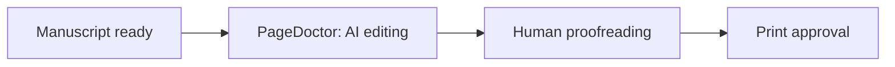
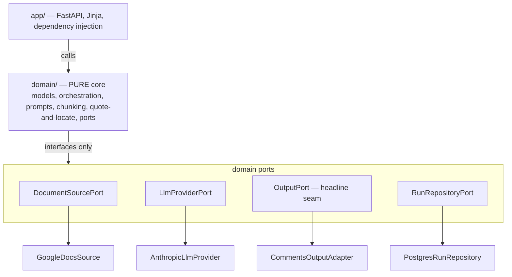

# PageDoctor

**AI editing for BookHub manuscripts — Sophie Hoffmann reads the book, the creator decides.**

PageDoctor is the AI editing stage in [BookHub](https://mybookhub.de)'s book-production pipeline. An internal project manager points the tool at a creator's Google Doc; an LLM proofreads and copy-edits the whole manuscript **in German** and writes its findings back into that same doc as **comments**, under the identity of a fictional editor, **Sophie Hoffmann**. The creator reviews natively in Google Docs. PageDoctor does the first pass; a human editor does the final polish.



> **Status: planning / pre-implementation.** The governing design is locked in [`CLAUDE.md`](./CLAUDE.md); the full handoff lives in [`docs/`](./docs). Code has not been scaffolded yet.

---

## What it does

- **Two check modes**, individually or combined: **Proofreading** (Korrektorat — spelling, grammar, punctuation) and **Editing** (Lektorat — style, consistency, repetition, readability).
- **Whole-book consistency pass** — inconsistent terms, spelling variants, and repetition stats across the entire manuscript, not just per chunk.
- **Configurable** per run: book type (cookbook / advice / novel-memoir / children's), strictness (light / standard / thorough), custom dictionary, and a cookbook **recipe mode** (quantity/ingredient/temperature/abbreviation consistency).
- **Sophie's voice** — every comment is in German, in the warm tone of a real editor, never "AI" language. Each comment carries the exact quoted original, the proposed change, a one-line German reason, the category, and a priority (Fehler / Empfehlung / Hinweis) — no brackets or ids in the visible text.

## How output works (and why)

A server-side service account **cannot** create native Google Docs suggestions (verified — see [`docs/PAGEDOCTOR_FEASIBILITY.md`](./docs/PAGEDOCTOR_FEASIBILITY.md)). So in v1 **Sophie posts structured comments and never edits the manuscript** — the creator applies every change themselves. The "write to the doc" step sits behind a **swappable output adapter**, so a future upgrade to native tracked-change suggestions (browser automation) can drop in without touching the AI engine, persona, modes, or config.

## Architecture

Hexagonal (ports & adapters). A **pure domain core** — editing logic, orchestration, and typed models — depends on nothing external. Google Docs, the LLM, the document source, and persistence are **adapters behind ports**. The output adapter is the headline seam.



See [`CLAUDE.md`](./CLAUDE.md) for the full design, domain model, AI-engine approach, data-protection rules, and document-safety guarantees.

## Tech stack

Python 3.12 · FastAPI + Jinja + HTMX · Pydantic v2 · Anthropic Claude API (`claude-opus-4-8`) · Google Docs/Drive APIs · PostgreSQL (metadata only) · ruff · mypy `--strict` · pytest · Docker.

## Data protection (hard requirements)

Manuscripts are confidential, unpublished works. PageDoctor analyses them only — it **never stores manuscript text** (the database holds run metadata only), **never** uses them for model training (zero data retention is required on the LLM provider), scopes Google access to the **single target doc**, and **never logs manuscript content**.

## Document safety

Output lands in a real author's doc, so the run is **idempotent and resumable**: a retry or restart never double-posts a comment, and a run that fails mid-write is marked incomplete — never presented as done.

## Development

> Planned developer interface (see [`CLAUDE.md`](./CLAUDE.md) §12). The scaffold lands with the Foundation issue.

```bash
make install      # install deps
make run          # run the app locally
make migrate      # apply Alembic migrations (run metadata schema)
make check        # ruff + mypy --strict + pytest   (CI gate)
make test         # run the test suite
make lint format typecheck
```

Copy `.env.example` → `.env`; every key is documented and required keys fail fast at startup. Start the metadata store with `docker compose up -d db`, then `make migrate` to create the `review_runs` table. Schema changes go through Alembic only — never hand-author a revision (use the `new-migration` skill).

`make check` is fully offline and free. A few tests hit real externals and are skipped by default: the prompt-cache and German-quality checks need `PAGEDOCTOR_LIVE_ANTHROPIC=1` (they cost tokens and need a zero-data-retention org), and the Postgres round-trip tests need `PAGEDOCTOR_LIVE_DB=1` with the `db` container running.

## Out of scope for v1

Native tracked-change suggestions and one-click accept/reject, browser automation, span-anchored comments, developmental editing, any creator-facing app, and the Phase-2 list (per-creator style memory, email notifications, stats dashboard, saved profiles, version history, batch mode, audit trail).

## Documentation

- [`docs/PAGEDOCTOR.md`](./docs/PAGEDOCTOR.md) — project outline
- [`docs/PAGEDOCTOR_CONTEXT.md`](./docs/PAGEDOCTOR_CONTEXT.md) — full handoff & team feedback
- [`docs/PAGEDOCTOR_FEASIBILITY.md`](./docs/PAGEDOCTOR_FEASIBILITY.md) — the Google Docs API reality and the locked output decision
